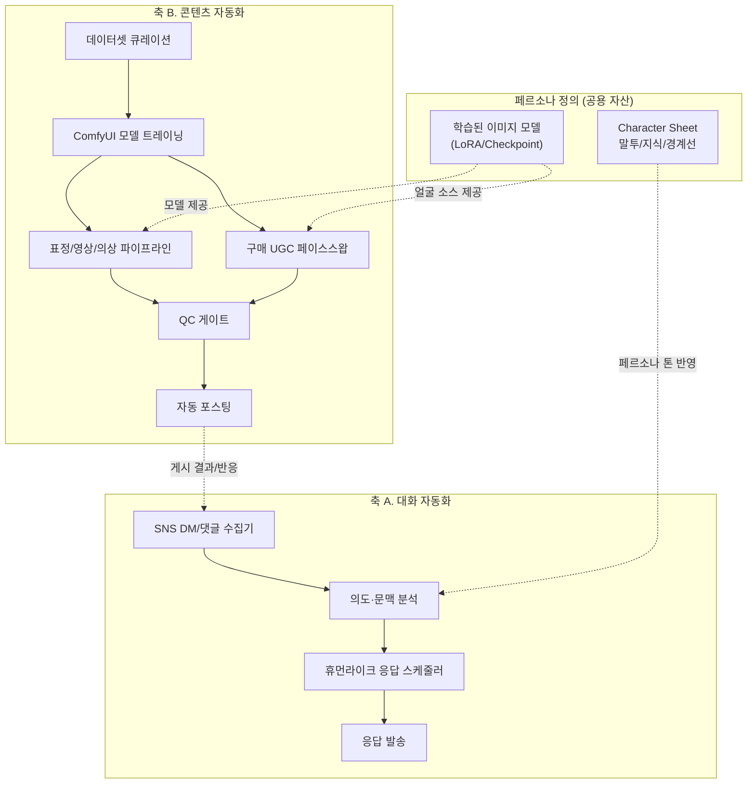

# AI Persona SNS Automation — 설계 문서

저장소: https://github.com/Benji5526/ai-persona-sns-automation

개인 페르소나를 중심으로 SNS 운영을 자동화하는 시스템의 설계 저장소입니다.
**이 저장소는 설계(design)만 다룹니다. 실제 구현 코드는 포함하지 않습니다.**

## 도메인 개요

이 시스템은 크게 두 축으로 구성됩니다.

1. **대화 자동화** — SNS DM/댓글을 페르소나가 인식하고, 사람이 하나씩 답장하듯
   자연스러운 속도와 순서로 응답하는 자동화 툴 (일괄 동시 발송 아님)
2. **콘텐츠 자동화** — ComfyUI로 학습한 페르소나 이미지 모델을 기반으로, 서로 다른 모델을 쓰는
   **3개의 독립 엔진**으로 콘텐츠를 생산한다: (a) 표정·의상·숏폼 영상 **생성 엔진**(diffusion),
   (b) 구매 UGC에 얼굴을 합성하는 **얼굴교체 엔진**(이미지/영상 공용), (c) 페르소나 이미지의 정체성으로
   드라이빙 영상의 움직임을 재현하는 **모션 리타겟팅 엔진**. 세 엔진은 페르소나 식별자·QC 게이트·
   에셋 스키마만 공유하며, (선택적으로) 연결된 SNS 계정에 자동 포스팅까지 이어진다.

운영 주체는 조지아(국가)에 소재하며, 특정 국가를 타겟팅하지 않는 글로벌 자연 유입 모델을 전제로
설계되었습니다 ([07-compliance.md](docs/07-compliance.md), [15-entity-and-tax.md](docs/15-entity-and-tax.md) 참고).

## MVP (최소 기능 제품)

이 프로젝트의 MVP는 3-엔진 콘텐츠 파이프라인이나 대화 자동화가 아니라,
**페르소나 컨셉이 실제로 반응을 얻는지를 가장 싸게 검증하는 것**입니다.
[11-recommended-sequence.md](docs/11-recommended-sequence.md)의 원칙(검증 전 투자 없음)에 따라,
아래 범위 밖의 모든 것은 검증 이후로 미룹니다.

| 구분 | MVP 범위 |
|---|---|
| 페르소나 | 1개, 캐릭터 시트 확정 ([06-data-model.md](docs/06-data-model.md)) |
| 콘텐츠 | 자동 생성 파이프라인 없이 소량 수동 제작 (이미지/영상 3엔진 미사용) |
| 대화 | 사람이 DM/댓글에 직접 응답 (자동 응답·휴먼라이크 스케줄러 미사용) |
| 게시 | 수동 크로스포스팅, 1~4개 플랫폼 |
| 인프라 | 하드웨어 구매 없음 — 필요시 온디맨드 클라우드 GPU + 저비용 LLM API만 사용 |
| 법인 | 개인사업자(소상공인 1% 세율)로 충분, Virtual Zone 법인 불필요 ([15-entity-and-tax.md](docs/15-entity-and-tax.md)) |
| 기간·예산 | 1~2개월, **월 1만원 미만** ([13-pilot-plan.md](docs/13-pilot-plan.md)) |

**MVP 밖 (검증 후 단계, [08-roadmap.md](docs/08-roadmap.md) Phase 2~)**: 얼굴교체·모션 리타겟팅 엔진,
vLLM 로컬 서빙, 완전 자동 응답, 자동 포스팅, 노트북/워크스테이션 구매, 법인 전환

**성공/중단 기준**: 참여율·팔로워 증가·DM 반응 + 운영 지속가능성(주관적 판단)을 8주간 추적 —
개선 추세가 없으면 이후 단계 투자를 보류하고 컨셉을 재검토합니다.

## 청사진 (도면 4매)

전체 설계를 도면 형식의 단일 페이지로 정리했습니다 — [blueprint/index.html](blueprint/index.html)
(다운로드 후 브라우저로 열어서 확인하세요. GitHub 미리보기에서는 렌더링되지 않습니다.)

## 콘텐츠 파이프라인 시뮬레이터

ComfyUI 노드 그래프 형태로 생성·페이스스왑·QC·자동 포스팅 파이프라인의 실행 흐름을 재현한 인터랙티브 데모 —
[pipeline-simulator/index.html](pipeline-simulator/index.html) (다운로드 후 브라우저로 열어서 확인, 실제 GPU/ComfyUI는 실행하지 않는 시뮬레이션입니다)

## 아키텍처

세부 다이어그램(시퀀스, 큐 구조, ERD 등)은 [docs/ARCHITECTURE.md](docs/ARCHITECTURE.md) 및 각 모듈 문서에 있습니다.

## 문서 구조

| 문서 | 내용 |
|---|---|
| [docs/ARCHITECTURE.md](docs/ARCHITECTURE.md) | 전체 시스템 아키텍처, 모듈 간 데이터 흐름 |
| [docs/01-reply-automation.md](docs/01-reply-automation.md) | DM/댓글 휴먼라이크 자동응답 설계 |
| [docs/02-model-training.md](docs/02-model-training.md) | ComfyUI 기반 페르소나 이미지 모델 트레이닝 |
| [docs/03-content-pipeline.md](docs/03-content-pipeline.md) | 표정 변화 / 숏폼 영상 / 의상·메이크업 체인지 파이프라인 |
| [docs/04-faceswap-ugc.md](docs/04-faceswap-ugc.md) | 얼굴교체 엔진 — 구매 UGC 페이스스왑 (이미지/영상) |
| [docs/05-auto-posting.md](docs/05-auto-posting.md) | 자동 포스팅 연동 (확장 단계) |
| [docs/06-data-model.md](docs/06-data-model.md) | 페르소나/대화/에셋 데이터 모델 |
| [docs/07-compliance.md](docs/07-compliance.md) | 운영·윤리·법적 고려사항 (필독) |
| [docs/08-roadmap.md](docs/08-roadmap.md) | 단계별 구축 로드맵 |
| [docs/09-llm-serving.md](docs/09-llm-serving.md) | 로컬 LLM 서빙 (vLLM, 멀티 LoRA) |
| [docs/10-budget-simulation.md](docs/10-budget-simulation.md) | 예상 예산 시뮬레이션 (GPU/LLM/UGC/SNS API) |
| [docs/11-recommended-sequence.md](docs/11-recommended-sequence.md) | 권장 착수 순서 — 무엇을 먼저 검증할 것인가 (필독) |
| [docs/12-hardware-spec.md](docs/12-hardware-spec.md) | 노트북 사양 및 예산 배분 (1,000만원 기준) |
| [docs/13-pilot-plan.md](docs/13-pilot-plan.md) | 파일럿 실행 계획 (1~2개월, 월 1만원 미만) |
| [docs/14-motion-reenactment.md](docs/14-motion-reenactment.md) | 모션 리타겟팅 엔진 — 이미지 인물을 영상 인물로 변경 |
| [docs/15-entity-and-tax.md](docs/15-entity-and-tax.md) | 법인 구조 및 세제 — 조지아(국가) 기준 |

## 설계 원칙

- **사람처럼 보이는 리듬** — 자동응답은 "동시에 여러 개"가 아니라 "한 번에 하나씩, 사람의 타이핑·확인·응답 리듬"을 흉내낸다.
- **페르소나 일관성** — 대화형/이미지형 산출물 모두 하나의 페르소나 정의(character sheet)에서 파생된다.
- **엔진은 실제로 같은 모델을 쓰는 것끼리만 묶는다** — 생성/얼굴교체/모션 리타겟팅은 서로 다른 모델 계열이라 별도 엔진으로 두되, 페르소나 식별자·QC 게이트·에셋 스키마는 공용으로 유지한다.
- **QC 게이트 필수** — 자동 생성물은 사람 검수 또는 자동 품질 체크를 통과해야 포스팅 단계로 넘어간다.
- **고지는 선택이 아니라 기본값** — 타겟 국가가 없는 글로벌 자연 유입 모델이므로, 국가별 개별 대응 대신 AI 생성/합성 콘텐츠 라벨링을 시스템 기본값으로 설계한다.
- **검증 전 투자 없음** — 하드웨어·법인 설립보다 먼저 저비용 파일럿으로 컨셉을 검증한다 ([11-recommended-sequence.md](docs/11-recommended-sequence.md)).

## 라이선스

[All Rights Reserved](LICENSE) — 저작권자의 사전 서면 동의 없이 복제·배포·2차 저작·상업적 이용을 금지합니다.
