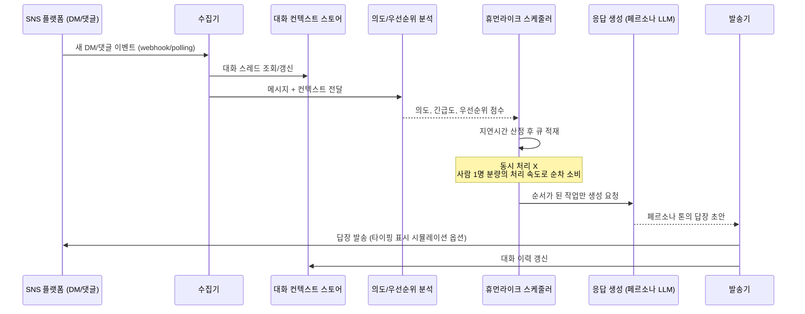

# 01. SNS DM/댓글 휴먼라이크 자동응답 설계

저장소: https://github.com/Benji5526/ai-persona-sns-automation

## 목표

정해진 시간에 여러 메시지에 "동시에" 답장하는 방식이 아니라,
**사람이 실제로 하나씩 확인하고 천천히 답장하는 것처럼** 보이는 자동화.
핵심은 응답 내용의 품질만이 아니라 **응답의 리듬(타이밍 패턴)** 을 설계하는 것입니다.

## 1. 파이프라인 개요

## 2. "사람처럼 보이는" 스케줄링 설계

일괄 동시 응답과 구분되는 핵심 요소:

- **동시성 제한(concurrency=1~N)**: 페르소나 계정당 동시에 처리 중인 응답은 소수로 제한. 사람 1명이 한 번에 여러 대화를 오가며 답하듯 낮은 동시성 유지.
- **지연 분포(latency distribution)**: 고정 딜레이가 아니라 확률분포(예: 로그정규분포)로 응답 지연을 샘플링해 기계적 패턴을 피함.
- **활동 시간대 모델링**: 페르소나별 "깨어있는 시간대"를 설정해, 새벽 시간대 메시지는 다음 활동 시간대로 자연스럽게 이월.
- **처리 순서**: 도착 순서(FIFO)를 기본으로 하되, 우선순위(VIP 팔로워, 반복 문의 등)에 따라 소폭 재정렬.
- **가변 응답 길이/속도**: 메시지 길이에 비례해 "읽는 시간 + 타이핑 시간"을 추정, 총 지연에 반영.
- **연속 응답 방지**: 같은 스레드에 짧은 시간 내 여러 번 답하지 않도록 스레드 단위 쿨다운 적용.
- **일일 총량 상한**: 하루 처리 가능한 대화량에 자연스러운 상한을 두어 "밤새 수백 개 처리" 같은 패턴을 방지.

> 설계 시 유의: 이 스케줄링은 "봇처럼 안 보이기 위한 지연"이지, 사용자 응답성을 해치는 지연이 아닙니다.
> 실제 사람이 응대할 때 걸리는 현실적인 시간 범위를 벗어나지 않도록 상한/하한을 둡니다.

## 3. 페르소나 인식 & 의도 분석

- **입력**: 원문 메시지, 발신자 프로필/이력, 대화 스레드 컨텍스트, 게시물(댓글인 경우) 맥락
- **분석 항목**:
  - 의도 분류 (문의/칭찬/불만/스팸/구매의사 등)
  - 감정/톤
  - 긴급도 (예: 불만·클레임은 우선순위 상향)
  - 안전 필터 (욕설/괴롭힘/위협 등 → 자동응답 제외, 필요시 사람 알림)
- **출력**: 우선순위 점수 + 응답 전략 태그 (예: "짧게 공감형", "정보 제공형", "에스컬레이션 필요")

## 4. 응답 생성

- 페르소나 정의([06-data-model.md](06-data-model.md) 참고)를 시스템 프롬프트/컨텍스트로 주입
- 대화 스레드의 최근 N턴을 컨텍스트로 포함해 일관성 유지
- 확신도가 낮거나 민감 주제(의료/금전/법률 조언, 강한 클레임 등)는 **자동 발송 대신 사람 검수 큐로 라우팅**
- 생성된 답변에 페르소나 어휘 사전/금칙어 필터를 후처리로 적용
- 의도 분석(3번)과 응답 생성 모두 **자체 호스팅 LLM(vLLM)** 을 추론 백엔드로 사용 — 페르소나별 LoRA 어댑터를
  하나의 베이스 모델에 동시 서빙해 페르소나가 늘어나도 서버 증설 없이 확장 가능. 상세 설계는
  [09-llm-serving.md](09-llm-serving.md) 참고

## 5. 발송 계층

- 플랫폼별 어댑터로 추상화 (Instagram/Threads/TikTok/카카오 등 각기 다른 API 특성 흡수)
- 플랫폼 API의 **레이트리밋/스팸 정책** 준수가 최우선 제약 조건 — 스케줄러의 동시성/총량 상한은 이 정책 범위 내에서 설계
- 발송 실패/차단 감지 시 자동 재시도 대신 사람에게 알림 (계정 정지 리스크 관리)

## 6. 운영 관점 체크리스트

- [ ] 페르소나별 활동 시간대·응답 속도 프로파일 정의
- [ ] 안전 필터 통과 못한 메시지의 에스컬레이션 경로 (사람 담당자 알림 채널)
- [ ] 플랫폼 ToS/API 정책 검토 (자동화 허용 범위, 공식 API 우선 사용)
- [ ] 대화 로그 보관 정책 및 개인정보 처리 방침
- [ ] AI 응답임을 사용자에게 고지할지 여부 및 방식 ([07-compliance.md](07-compliance.md) 참고)
