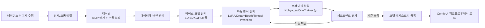

# 02. ComfyUI 기반 페르소나 이미지 모델 트레이닝

저장소: https://github.com/Benji5526/ai-persona-sns-automation

## 목표

특정 페르소나(가상 얼굴/캐릭터)를 일관되게 생성할 수 있는 이미지 모델을 학습하고,
이후 모든 콘텐츠 파이프라인([03](03-content-pipeline.md), [04](04-faceswap-ugc.md))에서 공용 자산으로 재사용.

## 1. 파이프라인 개요

## 2. 데이터셋 설계

- **이미지 수량/다양성**: 각도, 조명, 표정, 배경이 다양한 레퍼런스 이미지 확보 (동일 인물/캐릭터 일관성이 핵심)
- **전처리**: 얼굴 중심 크롭, 해상도 통일, 중복/저품질 이미지 제거
- **캡셔닝**: 자동 태거(WD14 등)로 1차 캡션 생성 후, 페르소나 고유 특징(트리거 워드 등)을 수동으로 보정
- **데이터셋 버전 관리**: 데이터셋 스냅샷과 학습 결과를 1:1로 추적 (재현성 확보)

## 3. 학습 방식 비교 (설계 시 선택지)

| 방식 | 특징 | 적합한 경우 |
|---|---|---|
| LoRA | 경량, 빠른 학습, 베이스 모델과 결합 사용 | 반복 실험, 다수 페르소나 운영 |
| DreamBooth (풀 파인튜닝) | 무겁지만 표현력 높음 | 소수의 핵심 페르소나에 집중 투자 |
| Textual Inversion | 매우 경량, 개념 임베딩 수준 | 스타일/보조 개념 추가 |

운영 규모(페르소나 개수)와 GPU 자원에 따라 LoRA를 기본으로 하고,
핵심 페르소나 1~2개만 더 무거운 방식으로 고품질화하는 하이브리드 전략을 권장합니다.

## 4. 트레이닝 실행 환경

- ComfyUI 자체는 추론(워크플로우 실행) 중심 도구이므로, 학습은 별도 트레이너(Kohya_ss, OneTrainer, sd-scripts 등)로 수행 후
  결과 체크포인트/LoRA 파일을 ComfyUI의 모델 디렉토리에 등록하는 구조를 권장
- 학습 파라미터(스텝 수, 학습률, 네트워크 rank 등)와 데이터셋 버전을 실험 단위로 기록 (실험 추적)

## 5. 평가 기준

- **정체성 일관성**: 다른 프롬프트/포즈/조명에서도 동일 인물로 인식되는지
- **과적합 여부**: 배경/의상까지 고정되어 다양성이 사라지지 않았는지
- **프롬프트 반응성**: 트리거 워드 외 일반 프롬프트(표정, 스타일 지시)에 정상 반응하는지
- 정량 지표(임베딩 유사도 등) + 정성 검수(사람 확인)를 병행

## 6. 모델 레지스트리

각 페르소나는 다음을 하나의 레코드로 관리합니다 (상세 스키마는 [06-data-model.md](06-data-model.md)):

- 페르소나 ID ↔ 모델 파일(체크포인트/LoRA) 매핑
- 학습에 사용된 베이스 모델 버전
- 권장 트리거 워드, 권장 CFG/샘플러 설정
- 평가 통과 여부 및 승인 이력

## 7. 운영 관점 체크리스트

- [ ] 레퍼런스 이미지의 초상권/사용권 확보 (본인 소유 또는 명시적 라이선스)
- [ ] 학습 데이터셋 보관 위치 및 접근 권한 관리
- [ ] 모델 파일 버전 관리 (재학습 시 이전 버전과의 산출물 비교 가능하도록)
- [ ] GPU 자원 스케줄링 (온디맨드 vs 상시 보유 비용 비교)
