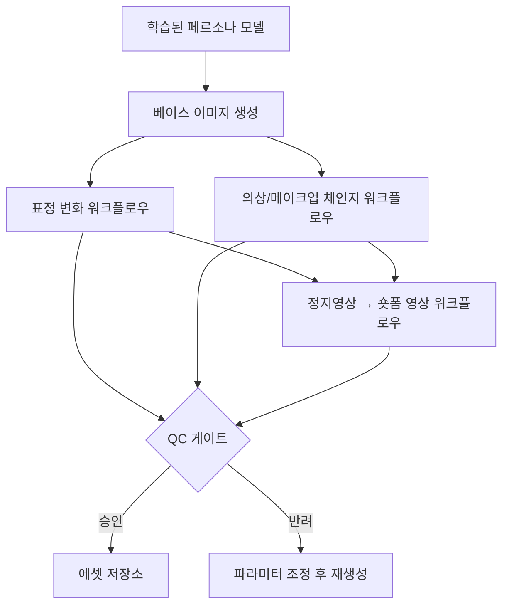

# 03. 표정 변화 / 숏폼 영상 / 의상·메이크업 체인지 파이프라인

## 목표

[02](02-model-training.md)에서 학습한 페르소나 모델을 입력으로 받아,
세부 표정 변화, 짧은 영상, 의상·메이크업 변경까지 가능한 ComfyUI 워크플로우 파이프라인을 구성.

## 1. 파이프라인 개요

## 2. 서브 파이프라인별 설계

### 2.1 표정 변화

- **접근 방식(택1 또는 조합)**:
  - ControlNet(예: 랜드마크/포즈 기반) + 프롬프트로 표정 유도
  - IP-Adapter/FaceID 계열로 정체성 고정 + 표정 프롬프트만 변화
  - 표정 참조 이미지(레퍼런스) 기반 표정 전이
- **일관성 유지 포인트**: 표정이 바뀌어도 동일 인물로 인식되도록 정체성 컨디셔닝(IPAdapter/FaceID) 가중치를 표정 강도와 함께 튜닝
- **산출물**: 표정 세트(기쁨/놀람/무표정 등) — 이후 숏폼 영상의 키프레임으로 재사용 가능

### 2.2 의상 / 메이크업 체인지

- **접근 방식**:
  - 인페인팅(마스크 기반) + 의상 프롬프트/레퍼런스로 특정 영역만 재생성
  - 가먼트 전이(예: 참조 의상 이미지를 IPAdapter로 주입)
  - 메이크업은 저강도 인페인팅 또는 이미지-투-이미지(낮은 denoise 강도)로 얼굴 정체성 보존
- **일관성 유지 포인트**: 얼굴/체형은 마스킹으로 보호하고, 의상 영역만 변경 대상으로 한정

### 2.3 정지 이미지 → 숏폼 영상

- **접근 방식(모델 후보)**:
  - 이미지-투-비디오 모델(예: AnimateDiff, Stable Video Diffusion 계열, 또는 최신 오픈소스 video diffusion 모델) 중 ComfyUI 노드 지원 여부 기준으로 선택
  - 표정 세트를 키프레임으로 사용한 보간(interpolation) 방식
- **일관성 유지 포인트**: 프레임 간 정체성/의상 깜빡임(flicker) 최소화 — temporal consistency 옵션이 있는 노드/모델 우선 사용
- **길이/포맷**: 플랫폼별 숏폼 규격(세로 9:16, 길이 등)에 맞춘 출력 프리셋 사전 정의

## 3. 워크플로우 오케스트레이션

- 각 ComfyUI 워크플로우(.json)를 **파라미터화된 템플릿**으로 관리 (페르소나 ID, 표정 태그, 의상 프롬프트 등을 외부에서 주입)
- ComfyUI의 API 모드(워크플로우를 API로 큐잉)를 활용해 외부 오케스트레이터(잡 큐)에서 배치 실행
- 생성 요청 단위: `{persona_id, workflow_type, params, priority}` 형태의 작업 아이템으로 큐에 적재

## 4. QC 게이트

- **자동 체크**: 얼굴 결손/왜곡 감지, 정체성 유사도(임베딩 비교)로 "다른 사람처럼 보이는" 산출물 자동 필터링
- **수동 체크**: 자동 체크 통과분 중 일부 샘플링 검수 또는 전수 검수(운영 초기 권장)
- **반려 처리**: 반려된 항목은 파라미터 조정 힌트와 함께 재생성 큐로 회송

## 5. 운영 관점 체크리스트

- [ ] 표정/의상 프리셋 라이브러리 정의 (페르소나별 "허용된 스타일 범위")
- [ ] 워크플로우 템플릿 버전 관리 (ComfyUI 워크플로우 JSON도 코드처럼 버저닝)
- [ ] 생성 비용(GPU 시간) 모니터링 및 워크플로우별 비용 프로파일링
- [ ] QC 통과 기준의 정량화 (임계값 튜닝 근거 기록)
