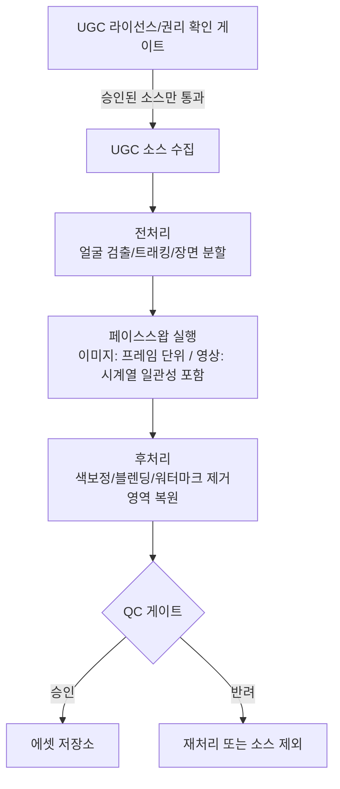

# 04. 구매 UGC 페이스스왑 자동화

## 목표

별도로 구매/라이선스한 UGC(사용자 제작 콘텐츠) 영상·이미지에 [02](02-model-training.md)에서 학습한
페르소나의 얼굴을 합성하여, 실사 촬영 없이 대량의 페르소나 콘텐츠를 확보.

> 이 파이프라인은 초상권·라이선스 이슈가 가장 큰 영역입니다. 기술 설계보다 **권리 확인 단계**를 먼저 배치합니다.
> 상세 근거는 [07-compliance.md](07-compliance.md) 참고.

## 1. 파이프라인 개요

## 2. 권리 확인 게이트 (선행 단계)

기술 파이프라인에 태우기 전에 반드시 통과해야 하는 체크:

- 구매/라이선스 계약서에 **얼굴 교체(합성) 및 상업적 2차 가공**이 명시적으로 허용되는지 확인
  (단순 "사용권"과 "변형·합성 후 재배포권"은 다른 권리 범위일 수 있음)
- UGC 내 등장인물의 초상권 관련 별도 동의(모델 릴리즈)가 포함되어 있는지 확인
- 라이선스 범위(지역/기간/플랫폼)와 실제 게시 계획이 일치하는지 확인
- 위 항목이 불명확한 소스는 **파이프라인 진입 자체를 차단**하고 소싱 단계로 반려

이 게이트는 소프트웨어 로직이 아니라 **운영 프로세스(체크리스트 + 승인 기록)**로 구현하는 것을 권장합니다.

## 3. 기술 파이프라인 설계

### 3.1 전처리

- 얼굴 검출 및 랜드마크 추출 (프레임별)
- 영상의 경우 얼굴 트래킹으로 프레임 간 위치/각도 변화 추적
- 장면 전환/얼굴 미노출 구간 분할 (스왑 대상 구간만 추출)

### 3.2 페이스스왑 실행

- **이미지**: 단일 프레임 스왑 (ComfyUI 내 페이스스왑 노드 활용, 정체성 임베딩은 [02](02-model-training.md)의 학습 모델/레퍼런스에서 추출)
- **영상**: 프레임별 스왑 + **시계열 일관성(temporal consistency)** 보정이 핵심 과제
  - 프레임 간 깜빡임 최소화를 위한 후처리(옵티컬 플로우 기반 보정 등) 고려
  - 처리 비용이 크므로 해상도/프레임레이트 다운샘플 후 스왑, 업스케일로 복원하는 전략도 검토
- 조명/각도 편차가 큰 소스는 사전에 부적합 소스로 필터링 (품질 저하 방지)

### 3.3 후처리

- 색보정/피부톤 블렌딩으로 합성 경계 자연스럽게 처리
- 원본 UGC의 워터마크/로고 등 라이선스 조건과 무관한 잔여 요소 처리

## 4. QC 게이트

- **자동 체크**: 정체성 유사도(페르소나 모델과의 임베딩 유사도), 프레임 간 흔들림/아티팩트 탐지
- **수동 체크**: 합성 경계, 표정-입모양 자연스러움 등 자동 탐지가 어려운 항목
- 반려 시 원본 소스 자체의 부적합 여부를 기록해 이후 소싱 기준에 반영 (피드백 루프)

## 5. 운영 관점 체크리스트

- [ ] UGC 소스별 라이선스 계약서 원문과 승인 이력을 자산 메타데이터에 연결 ([06-data-model.md](06-data-model.md))
- [ ] 합성 콘텐츠에 대한 내부 라벨링(무엇이 합성인지 추적 가능하도록) — 고지 의무 이행의 전제
- [ ] 페르소나별 "허용된 UGC 카테고리" 정의 (예: 특정 노출 수위, 상황 설정 제한)
- [ ] 처리 비용이 큰 영상 스왑은 우선순위/쿼터 관리로 GPU 자원 보호
