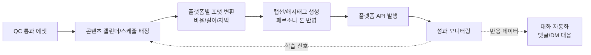

# 05. 자동 포스팅 연동 (확장 단계)

## 목표

QC를 통과한 콘텐츠 에셋을 연결된 SNS 계정에 자동으로 게시. 대화 자동화([01](01-reply-automation.md))와
콘텐츠 자동화([02](02-model-training.md)~[04](04-faceswap-ugc.md))의 산출물을 최종적으로 연결하는 단계입니다.

## 1. 파이프라인 개요

## 2. 설계 포인트

- **콘텐츠 캘린더**: 페르소나별 게시 빈도/시간대를 사람의 SNS 사용 패턴처럼 설계 (자동응답의 "활동 시간대" 개념과 동일선상)
- **포맷 변환**: 플랫폼별 규격(세로/가로 비율, 길이 제한, 자막 유무)에 맞춘 자동 변환 단계
- **캡션 생성**: 페르소나 character sheet를 기반으로 캡션/해시태그를 생성, 최종 발행 전 최소한의 검수 단계 권장
- **발행**: 각 플랫폼의 공식 API(가능한 경우)를 우선 사용, 비공식 자동화는 계정 정지 리스크가 크므로 지양
- **성과 모니터링**: 게시물 반응(좋아요/댓글/DM 유입)을 [01](01-reply-automation.md)의 수집기와 동일한 파이프라인으로 흡수해 순환 구조 완성

## 3. 운영 관점 체크리스트

- [ ] 플랫폼별 "AI 생성 콘텐츠" 라벨링/고지 기능 지원 여부 확인 및 적용 ([07-compliance.md](07-compliance.md))
- [ ] 발행 전 최종 사람 승인 단계 유지 여부 결정 (완전 자동 vs 승인 후 자동)
- [ ] 플랫폼 API 정책/약관 변경 모니터링 (자동화 허용 범위는 자주 바뀜)
- [ ] 게시 실패/계정 제재 발생 시 자동 중단 및 알림 (연쇄 실패 방지)

## 4. 단계적 도입 권장

이 단계는 대화 자동화·콘텐츠 자동화보다 리스크(계정 정지, 정책 위반)가 크므로,
초기에는 **"자동 생성 + 사람이 발행 버튼만 누르는"** 반자동 방식으로 시작해
운영 안정성이 확인된 뒤 완전 자동 발행으로 확장하는 것을 권장합니다. (로드맵 [08](08-roadmap.md) 참고)
