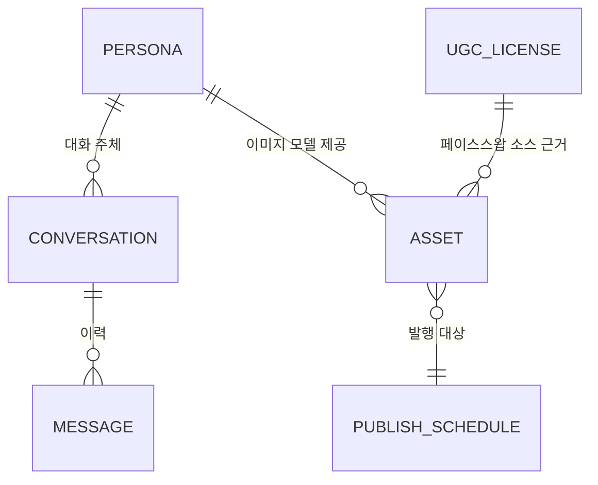

# 06. 데이터 모델 설계

설계 단계이므로 실제 스키마(DB 테이블/DDL)가 아닌 **개념 모델**을 YAML 예시로 표현합니다.

## 1. 페르소나 정의 (Persona / Character Sheet)

```yaml
persona:
  id: persona_001
  display_name: "예시 페르소나"
  voice:
    tone: ["친근함", "짧은 문장", "이모지 절제"]
    forbidden_topics: ["정치", "의료 조언", "금전 거래"]
    signature_phrases: ["...", "..."]
  activity_profile:
    active_hours: ["09:00-12:00", "20:00-23:30"]
    avg_reply_delay_sec: { min: 20, max: 900, distribution: "lognormal" }
    daily_reply_cap: 150
  image_model:
    base_model: "sdxl-1.0"
    lora_ref: "models/persona_001_v3.safetensors"
    trigger_words: ["p001face"]
    approved_at: "2026-08-01"
    approved_by: "internal-review"
  content_style:
    allowed_outfits: ["casual", "office", "sportswear"]
    allowed_expressions: ["smile", "neutral", "surprised"]
    restricted_content: ["..."]
```

## 2. 대화 스레드 / 컨텍스트

```yaml
conversation:
  thread_id: thread_abcd
  persona_id: persona_001
  platform: "instagram_dm"
  user_ref: "hashed_user_id"
  status: "awaiting_reply" # collected | queued | replied | escalated
  priority_score: 0.42
  intent_tags: ["문의"]
  history:
    - role: user
      text: "..."
      ts: "2026-09-08T10:00:00+09:00"
    - role: persona
      text: "..."
      ts: "2026-09-08T10:04:12+09:00"
  scheduled_reply_at: "2026-09-08T10:05:30+09:00"
```

## 3. 콘텐츠 에셋

```yaml
asset:
  id: asset_0001
  persona_id: persona_001
  type: "video" # image | video
  source: "generated" # generated | ugc_faceswap
  ugc_license_ref: null # ugc_faceswap인 경우 필수: license_0001
  pipeline:
    workflow_id: "expr_to_video_v2"
    params: { expression: "smile", outfit: "casual" }
  qc:
    auto_check_score: 0.93
    manual_review: "approved"
    reviewed_by: "user@example.com"
    reviewed_at: "2026-09-08T09:00:00+09:00"
  publish:
    status: "scheduled" # draft | scheduled | published | rejected
    target_platforms: ["instagram_feed"]
    scheduled_at: "2026-09-09T19:00:00+09:00"
```

## 4. UGC 라이선스 레코드

```yaml
ugc_license:
  id: license_0001
  source_vendor: "..."
  purchased_at: "2026-08-15"
  scope:
    allows_face_modification: true
    allows_commercial_redistribution: true
    territory: ["KR"]
    expires_at: "2027-08-15"
  model_release_on_file: true
  contract_doc_ref: "contracts/license_0001.pdf"
  approved_by: "legal-review"
```

## 5. 관계 요약



`ASSET.ugc_license_ref`가 필수인 이유는 [04-faceswap-ugc.md](04-faceswap-ugc.md)의 권리 확인 게이트를
데이터 모델 수준에서 강제하기 위함입니다 (라이선스 근거 없는 페이스스왑 에셋은 생성 자체가 막히도록 설계).
