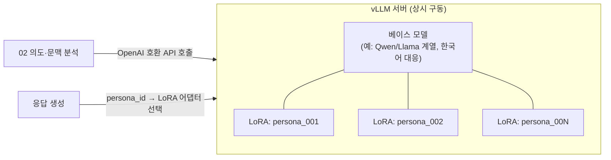

# 09. 로컬 LLM 서빙 (vLLM)

저장소: https://github.com/Benji5526/ai-persona-sns-automation

## 목표

[01-reply-automation.md](01-reply-automation.md)의 의도·문맥 분석과 응답 생성에 사용하는 LLM을
외부 API가 아닌 **자체 호스팅(vLLM)** 으로 구성하여, 비용·데이터 통제·페르소나 확장성을 확보.

## 1. 왜 vLLM인가

| 특성 | 이 프로젝트에서의 의미 |
|---|---|
| PagedAttention 기반 고처리량 서빙 | 다수 대화 스레드를 동시에 처리해도 GPU 메모리 낭비 없이 처리량 유지 |
| OpenAI 호환 API 서버 내장 | 기존에 관리형 LLM API를 가정하고 짠 코드/프롬프트 로직을 엔드포인트만 바꿔 재사용 가능 |
| **멀티 LoRA 동시 서빙** | 페르소나별 말투/성격을 LoRA로 파인튜닝해두면, **하나의 베이스 모델 서버에 여러 페르소나 어댑터를 동시에 로드**해 서빙 가능 → 페르소나가 늘어나도 서버를 늘리지 않고 어댑터만 추가 |
| 양자화 지원 (AWQ/GPTQ/FP8 등) | GPU 메모리 제약 환경에서도 적당한 크기의 베이스 모델 서빙 가능 |
| Continuous batching | 대화 자동화 특유의 "짧고 불규칙하게 들어오는 요청"에 효율적으로 대응 |

> 페르소나 수가 늘어날 때 이미지 모델은 [02-model-training.md](02-model-training.md)처럼 페르소나별 LoRA 파일로 관리하는 것과
> 대칭적으로, 대화용 LLM도 페르소나별 LoRA + 공용 베이스 모델 구조로 맞추면 두 축의 확장 전략이 일관됩니다.

## 2. 아키텍처 반영

- 의도 분석과 응답 생성 두 단계 모두 동일한 vLLM 서버를 백엔드로 사용 (역할이 다른 프롬프트/파라미터로 같은 엔드포인트 호출)
- 요청 시 `persona_id`를 어댑터 이름으로 매핑해 vLLM에 전달 → 페르소나별 별도 배포 불필요

## 3. GPU 자원 경합 — 콘텐츠 파이프라인과의 관계

vLLM(대화 자동화, 상시·저지연 필요)과 ComfyUI 트레이닝/생성/페이스스왑([02](02-model-training.md)~[04](04-faceswap-ugc.md), 배치성·GPU 집약)은
같은 GPU 자원을 두고 경합할 수 있습니다. [ARCHITECTURE.md](ARCHITECTURE.md)의 배치 경계 설계에 다음 옵션을 반영합니다.

| 옵션 | 설명 | 적합한 경우 |
|---|---|---|
| GPU 풀 분리 | vLLM 전용 소형 GPU 상시 할당 + ComfyUI용 대형 GPU는 온디맨드 | 대화 응답 지연 SLA가 중요한 경우 (권장) |
| `gpu_memory_utilization` 조정 | 하나의 GPU에서 vLLM이 일부 메모리만 점유, 나머지를 ComfyUI와 시분할 | GPU 자원이 제한적인 초기 단계 |
| 완전 분리 배포 | 물리적으로 다른 머신/노드에 배치 | 운영 규모가 커진 이후 |

- 대화 자동화는 [01-reply-automation.md](01-reply-automation.md)의 휴먼라이크 스케줄러 때문에 애초에 대량 동시 요청이 발생하지 않으므로,
  vLLM에 필요한 GPU 자원은 콘텐츠 파이프라인보다 훨씬 작습니다. 소형 GPU 상시 할당 전략이 비용 효율적입니다.

## 4. 베이스 모델 선택 기준

- 한국어 응답 품질 (페르소나 대화가 한국어 중심이라면 필수 검증 항목)
- 라이선스 — 상업적 서비스에 사용 가능한 라이선스인지 확인 (연구용 전용 라이선스 모델 배제)
- 크기/양자화 후 지연시간 — 휴먼라이크 스케줄러가 요구하는 지연 범위([06-data-model.md](06-data-model.md)의 `avg_reply_delay_sec`) 안에서
  "생성" 자체는 충분히 빨라야 함 (지연은 스케줄러가 의도적으로 늘리는 것이지, 모델이 느려서 늦는 것이 아니어야 함)
- LoRA 파인튜닝 생태계 성숙도 (페르소나별 어댑터 학습 난이도)

## 5. 학습(LoRA) vs 프롬프트 기반 — 언제 학습이 필요한가

이 문서의 멀티 LoRA 서빙은 "학습된 페르소나 어댑터가 있다"는 것을 전제로 하지만,
**처음부터 학습이 필수는 아닙니다.** 페르소나 말투는 시스템 프롬프트(캐릭터 시트, [06-data-model.md](06-data-model.md)의
`persona.voice`)와 대화 예시(few-shot)만으로도 상당 수준 재현 가능합니다.

| 방식 | 장점 | 단점 | 적합한 단계 |
|---|---|---|---|
| 프롬프트 기반 (캐릭터 시트 + few-shot) | 데이터 수집·학습 파이프라인 불필요, 즉시 반복 실험 가능 | 요청마다 컨텍스트 토큰 소모, 긴 대화에서 톤이 흔들릴 수 있음 | [로드맵](08-roadmap.md) Phase 1 (대화 자동화 MVP) |
| LoRA 파인튜닝 | 응답이 짧고 안정적, 프롬프트 길이·비용 절감 | 양질의 대화 데이터 확보 필요, 재학습/버전관리 부담 | 실제 대화 로그가 쌓인 이후, Phase 6(다중 페르소나 스케일아웃) 전후 |

**학습으로 전환할 신호**:
- 프롬프트만으로는 톤/캐릭터가 대화가 길어질수록 자꾸 무너짐
- 페르소나별로 매번 긴 캐릭터 시트를 프롬프트에 넣는 것이 지연·비용에 유의미하게 영향
- 실제 운영 대화 로그가 쌓여 "이 페르소나가 실제로 이렇게 답했다"는 학습 데이터가 확보됨 (Phase 1~3의 사람 검수 로그를 데이터 소스로 재사용)

**권장 순서**: Phase 1은 프롬프트 기반으로 시작 → 페르소나별 운영 데이터가 쌓이면 그 페르소나부터 선택적으로 LoRA 학습 →
학습된 페르소나만 vLLM 멀티 LoRA에 등록, 나머지는 계속 프롬프트 기반으로 같은 베이스 모델을 공유.

## 6. 운영 관점 체크리스트

- [ ] 베이스 모델 라이선스 및 상업적 이용 조건 확인
- [ ] 페르소나별 LoRA 학습 데이터(대화 스타일 예시) 준비 및 버전 관리 ([06-data-model.md](06-data-model.md) 확장)
- [ ] 로컬 모델 특유의 안전 필터 보강 (관리형 API 대비 자체 가드레일 필요성 검토)
- [ ] 처리량/지연 모니터링 — vLLM 자체 지표(throughput, TTFT 등) 대시보드화
- [ ] GPU 장애/과부하 시 폴백 전략 (예: 큐 적재 후 대기, 또는 사람 에스컬레이션으로 전환)
