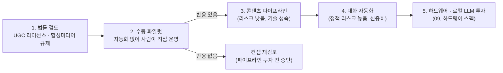

# 11. 권장 착수 순서 (컨설턴트 관점)

저장소: https://github.com/Benji5526/ai-persona-sns-automation

> 이 문서는 나머지 설계 문서(00~10)가 "어떻게 만들 것인가"를 다룬다면,
> 이 문서는 "무엇을 먼저 검증하고, 무엇을 나중으로 미룰 것인가"를 다룹니다.
> 설계가 정교한 것과 사업이 검증된 것은 다릅니다 — 이 문서는 후자를 가장 싸게 확인하는 순서를 제안합니다.

## 1. 핵심 진단

지금까지의 설계는 "어떻게 잘 만들 것인가"에 최적화되어 있습니다. 그런데 이 프로젝트에서
가장 큰 리스크는 기술이 아니라 다음 두 가지입니다.

1. **이게 애초에 허용되는 일인가** — 구매한 UGC에 얼굴을 바꿔 쓰는 것, 사람인 척 DM/댓글을 자동 응대하는 것은
   [07-compliance.md](07-compliance.md)에서 짚었듯 라이선스·초상권·플랫폼 정책·고지 의무와 정면으로 맞닿습니다.
   휴먼라이크 스케줄러로 타이밍을 아무리 사람처럼 흉내내도, "자동화 자체가 허용되는가"라는
   질문은 속도와 무관하게 별도로 풀어야 합니다.
2. **이 컨셉이 실제로 통하는가** — 파이프라인을 아무리 정교하게 만들어도, 페르소나가 사람들의 반응을
   끌어내지 못하면 무의미합니다. 이건 자동화를 만들기 전에, 자동화 없이 가장 싸게 확인할 수 있는 질문입니다.

두 질문 모두 하드웨어 구매나 파이프라인 정교화보다 **먼저, 그리고 훨씬 싸게** 답할 수 있습니다.

## 2. 권장 순서

### 1단계 — 법률 검토 (착수 전 필수)

- UGC 구매 계약서에 "얼굴 교체(합성) 및 상업적 재배포"가 명시적으로 포함되는지 확인
- 대한민국 기준 개인정보보호법·정보통신망법·표시광고법과 딥페이크/합성 콘텐츠 관련 규제 검토
- 비용이 가장 적게 들면서, 나중에 사업 전체를 무효화할 수 있는 리스크를 가장 먼저 제거하는 단계
- 상세 체크리스트: [07-compliance.md](07-compliance.md)

### 2단계 — 수동 파일럿 (자동화 없이)

- 페르소나 1개를 **사람이 직접** 몇 주간 운영 (DM/댓글 응답, 콘텐츠 게시 모두 수동)
- 목표: 파이프라인 개발 비용을 전혀 들이지 않고 "이 페르소나 컨셉이 반응을 얻는가"를 검증
- 이 단계에서 반응이 없다면, 3~5단계에 투자할 이유가 없음 — [08-roadmap.md](08-roadmap.md) Phase 0과 Phase 1 사이에
  실제로는 빠져 있던 단계
- 이미지/영상도 이 단계에서는 자동 파이프라인 없이 소량 수동 제작으로 대체 가능

### 3단계 — 콘텐츠 파이프라인 (반응이 확인된 이후)

- [02](02-model-training.md)~[05](05-auto-posting.md)의 이미지/영상 생성·페이스스왑·포스팅 파이프라인 구축
- 대화 자동화보다 정책 리스크가 낮고 기술적으로도 더 성숙한 영역이므로 먼저 투자
- 이 단계부터는 [10-budget-simulation.md](10-budget-simulation.md)의 클라우드 GPU 대여로 시작 (자체 하드웨어 아직 불필요)

### 4단계 — 대화 자동화 (신중하게)

- [01-reply-automation.md](01-reply-automation.md)의 휴먼라이크 스케줄러 도입
- 정책 리스크가 가장 높은 영역이므로, 사람 승인 후 발송하는 반자동 단계를 충분히 거친 뒤 확장
  ([05-auto-posting.md](05-auto-posting.md)의 단계적 도입 원칙과 동일한 논리)

### 5단계 — 하드웨어 · 로컬 LLM 투자 (규모가 실제로 생겼을 때)

- 페르소나 수·트래픽이 늘어 클라우드 대여 비용이 자체 보유 비용을 넘어서는 시점에 투자
- [09-llm-serving.md](09-llm-serving.md)의 vLLM 멀티 LoRA, 노트북/워크스테이션 스펙 검토는 이 시점에 재논의

## 3. 이 순서를 지켰을 때 얻는 것

- 법률 리스크가 가장 낮은 비용으로 가장 먼저 제거됨
- 컨셉이 실패할 경우, 파이프라인 개발비·하드웨어 구매비를 전혀 쓰지 않고 알 수 있음
- 정책 리스크가 높은 영역(대화 자동화)을 가장 마지막에, 가장 신중하게 다룸
- 하드웨어 투자가 "필요해서 사는 것"이지 "먼저 사놓고 나중에 정당화하는 것"이 되지 않음

## 4. 지금 시점에서의 구체적 제안

- 노트북/워크스테이션 구매는 최소 3단계(콘텐츠 파이프라인 실사용) 이후로 미루는 것을 권장
- 그 전까지는 [10-budget-simulation.md](10-budget-simulation.md)의 클라우드 GPU 대여 + 저비용 LLM API로 파일럿 진행
- 1단계(법률 검토)는 지금 바로 시작 가능하며, 별도 엔지니어링 리소스 없이 진행 가능
