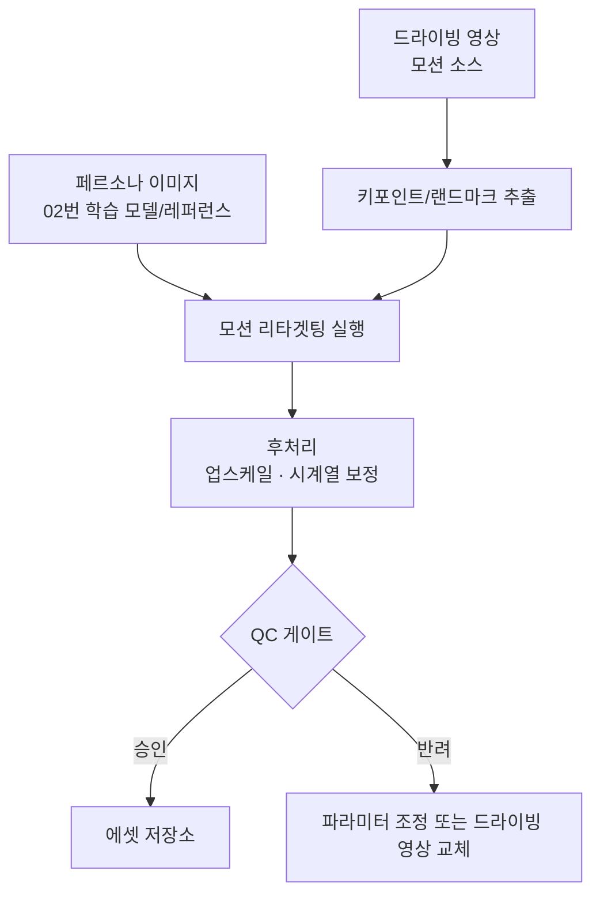

# 14. 모션 리타겟팅 엔진 — 이미지 인물을 영상 인물로 변경

저장소: https://github.com/Benji5526/ai-persona-sns-automation

## 목표

페르소나의 정지 이미지 한 장을 입력받아, 별도의 "드라이빙 영상"(모션 소스)의 움직임·표정을 그대로 따라가는
새 영상을 생성합니다. **[04-faceswap-ugc.md](04-faceswap-ugc.md)의 얼굴교체 엔진과는 기술적으로 다른 파이프라인**입니다.

## 1. 얼굴교체 엔진과의 차이

| 구분 | 얼굴교체 엔진 ([04](04-faceswap-ugc.md)) | 모션 리타겟팅 엔진 (이 문서) |
|---|---|---|
| 방식 | 원본 영상의 얼굴 영역을 페르소나 얼굴로 **덮어씌움** (픽셀 오버레이) | 페르소나 이미지의 정체성을 조건으로, 드라이빙 영상의 움직임에 맞춰 프레임을 **재생성** |
| 대표 모델 | inswapper / GHOST / SimSwap류 | LivePortrait / Hallo / EMO / AnimateAnyone류 |
| 원본 영상의 배경·신체 | 얼굴 제외 원본 그대로 유지 | 모델에 따라 신체·배경까지 재생성될 수 있음 (모델 선택에 따라 다름) |
| 입력 | 페르소나 얼굴 + UGC 영상/이미지 | 페르소나 이미지 1장 + 드라이빙 영상(모션 소스) |
| 실패 시 특징 | 경계 부자연스러움, 깜빡임 | 워핑(뒤틀림) 아티팩트, 정체성 이탈 |

같은 "얼굴을 바꾼다"는 결과처럼 보여도 내부 모델·의존성·실패 양상이 전혀 달라 하나의 엔진으로 묶지 않습니다.
다만 페르소나 식별자([02-model-training.md](02-model-training.md))와 QC 게이트, 에셋 스키마는 공용으로 사용합니다.

## 2. 파이프라인 개요

- 드라이빙 영상도 UGC와 마찬가지로 **저작권/모델 릴리즈 확인이 필요한 소스**입니다 —
  [04-faceswap-ugc.md](04-faceswap-ugc.md)의 권리 확인 게이트와 동일한 원칙을 적용합니다
  ([07-compliance.md](07-compliance.md) 참고).

## 3. 기술 선택지 비교 (설계 시 검토 대상)

| 모델 계열 | 특징 | 적합한 경우 |
|---|---|---|
| LivePortrait류 | 얼굴 중심, 빠른 추론, 표정 디테일 우수 | 상반신/얼굴 클로즈업 위주 콘텐츠 |
| Hallo / EMO류 | 오디오 기반 립싱크 포함 가능 | 말하는 페르소나 영상(음성 동기화 필요 시) |
| AnimateAnyone류 | 전신 모션까지 재현 | 전신이 등장하는 숏폼 콘텐츠 |

실제 채택 모델은 [03-content-pipeline.md](03-content-pipeline.md)의 표정/영상 생성 파이프라인과 마찬가지로
ComfyUI 워크플로우 노드 지원 여부를 기준으로 선정합니다.

## 4. QC 게이트 (얼굴교체 엔진과 다른 기준 추가)

- **정체성 유사도**: [04](04-faceswap-ugc.md)와 동일한 임베딩 비교 기준 적용
- **모션 자연스러움**: 워핑/뒤틀림 아티팩트, 관절·윤곽 붕괴 여부 (이 엔진 고유의 실패 양상)
- **드라이빙 영상 권리 확인 여부**: UGC 권리 확인 게이트와 동일하게 필수 통과 조건

## 5. 운영 관점 체크리스트

- [ ] 드라이빙 영상 소스의 저작권/모델 릴리즈 확보 ([07-compliance.md](07-compliance.md) 기준 동일 적용) —
  [06-data-model.md](06-data-model.md)의 `asset.source_license_ref`로 강제 연결
- [ ] 페르소나별 "허용된 드라이빙 영상 카테고리" 정의 (얼굴교체 엔진의 UGC 카테고리 제한과 동일한 논리)
- [ ] 신체·배경까지 재생성되는 모델을 쓸 경우, 원본 드라이빙 영상 인물의 초상권 이슈 별도 검토
  (얼굴만 바꾸는 페이스스왑보다 권리 관계가 더 복잡해질 수 있음)
- [ ] GPU 자원은 [ARCHITECTURE.md](ARCHITECTURE.md)의 배치 경계 설계에 따라 얼굴교체 엔진과 같은 배치성 GPU 풀 공유
