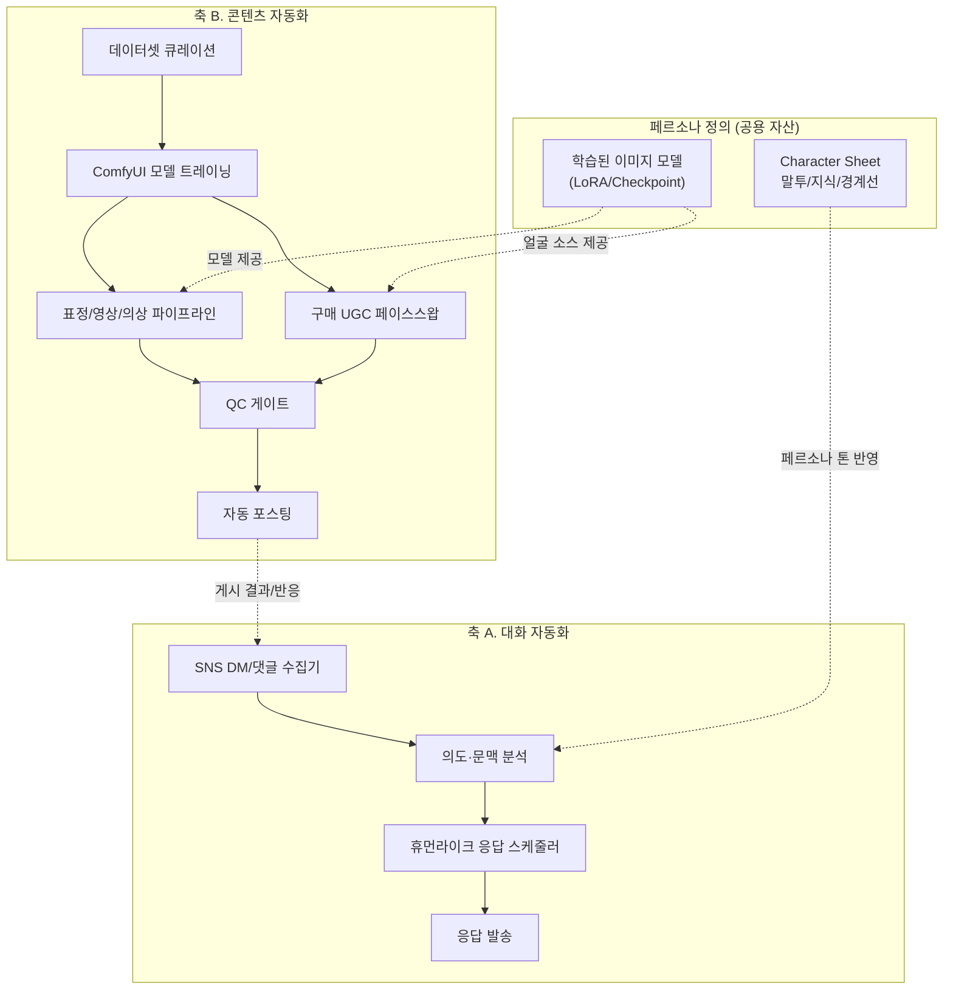
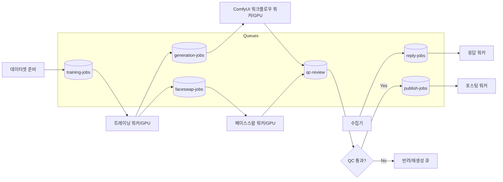

# 전체 아키텍처

## 1. 시스템 맵

시스템은 서로 독립적으로 동작할 수 있는 두 개의 축과, 이를 잇는 공용 자산(페르소나 정의)으로 구성됩니다.

두 축은 완전히 분리해 개발 가능하지만, 실제 운영 시에는 "콘텐츠 자동화"가 만든 게시물에 달리는 댓글/DM을 "대화 자동화"가 받아 응대하는 순환 구조를 이룹니다.

## 2. 컴포넌트 책임 요약

| 컴포넌트 | 책임 | 상세 문서 |
|---|---|---|
| SNS 수집기 | 플랫폼별 DM/댓글 웹훅·폴링 수신, 정규화 | [01](01-reply-automation.md) |
| 응답 스케줄러 | "동시 발송"이 아닌 "순차·지연" 큐잉 | [01](01-reply-automation.md) |
| 모델 트레이닝 | 페르소나 이미지 데이터셋 → LoRA/체크포인트 | [02](02-model-training.md) |
| 표정/영상/의상 파이프라인 | ComfyUI 워크플로우 그래프로 변형 생성 | [03](03-content-pipeline.md) |
| 페이스스왑 파이프라인 | 구매 UGC에 학습된 얼굴 합성 | [04](04-faceswap-ugc.md) |
| QC 게이트 | 자동/수동 품질 검수, 통과분만 다음 단계 진행 | [03](03-content-pipeline.md), [04](04-faceswap-ugc.md) |
| 자동 포스팅 | 검수 통과 에셋을 SNS API로 발행 | [05](05-auto-posting.md) |

## 3. 배치 경계 (제안)

| 영역 | 실행 위치 제안 | 이유 |
|---|---|---|
| DM/댓글 수집·응답 스케줄러 | 상시 구동 서버/워커 (경량) | 저지연, 상시성 필요 |
| LLM 추론(의도분석·답변생성) | 관리형 LLM API 또는 자체 호스팅 | 페르소나 톤 제어 난이도에 따라 선택 |
| ComfyUI 트레이닝·생성 파이프라인 | GPU 워커 (온디맨드/스팟) | 무겁고 배치성, 상시 구동 불필요 |
| 페이스스왑 배치 | GPU 워커, 트레이닝과 큐 공유 가능 | 동일 GPU 자원 재사용 |
| QC/포스팅 오케스트레이션 | 경량 서버/워크플로우 엔진 | 상태 관리 중심, GPU 불필요 |

## 4. 오케스트레이션 큐 구조 (제안)

각 단계는 큐로 분리되어 있어 GPU 파이프라인(트레이닝·생성·페이스스왑)의 장애가 대화 자동화(상시 응답)에 영향을 주지 않습니다.
